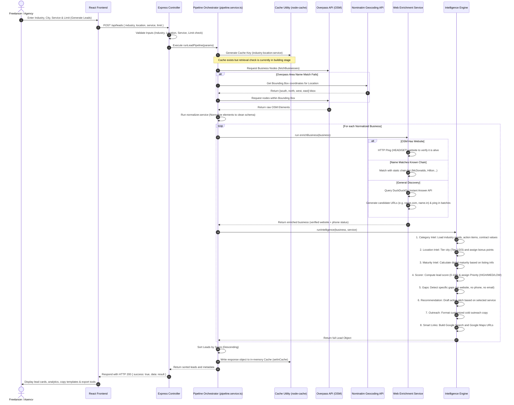

# AI Lead Intelligence Engine

A comprehensive B2B lead generation, enrichment, and cold outreach system designed to discover underserved local business leads, analyze their digital maturity, detect critical gaps, and generate customized service pitches—all with zero API data costs.

---

## 🎯 Objective & Goals

Standard lead generation databases (e.g., ZoomInfo, Apollo) are expensive, focus heavily on corporate B2B profiles, and charge per-lead fees. The **AI Lead Intelligence Engine** addresses this by targeting local brick-and-mortar businesses using free, crowdsourced geospatial data.

*   **Zero-Cost Lead Harvesting**: Bypass high database subscription costs by extracting physical business data directly from OpenStreetMap (OSM) via the Overpass API.
*   **Opportunity-Centric Scoring (Inverse Maturity)**: Unlike typical engines that score based on business success, this platform reverses the priority: **missing data = higher lead value**. A business with no website or missing contact details represents the highest potential conversion value for an agency or freelancer.
*   **Underserved Market Discovery**: Leverage city tiering (Tier 1 vs. Tier 2 vs. Tier 3) to highlight businesses in growing or remote areas where competition is low and digital adoption demand is high.
*   **Automated Personalization**: Instantly turn raw business data into structured outreach pitches and professional cold emails tailored to the specific business category and identified digital gaps.

---

## 🛠️ Technology Stack

The project is built as a lightweight, modular monorepo containing a React-based client and a TypeScript-based Express server.

### Frontend
| Technology | Purpose | Key Usage / Implementation |
| :--- | :--- | :--- |
| **React 19** | User Interface Engine | Renders state-driven interactive components. |
| **Vite** | Build Tooling & Bundling | Handles fast hot-module reloading and optimized builds. |
| **TypeScript** | Type Safety | Enforces compiler-level schema validation of lead and search parameters. |
| **Material UI (MUI)** | Component Layouts | Supplies styling foundations, icon widgets, and error boundary wrappers. |
| **Recharts** | Data Visualization | Renders interactive distribution charts on the Analytics page. |
| **Axios** | API Communication | Handles client-server network requests. |
| **React Router v7** | Client-Side Routing | Manages application routes and Protected Route navigation shields. |
| **LocalStorage** | Client-side Persistence | Persists user bookmarks (Saved Leads) and mock session authentication. |
| **Custom Vanilla CSS** | Aesthetics & Layouts | Custom glassmorphic dark theme (`#0f172a` base) with interactive hover transitions. |

### Backend
| Technology | Purpose | Key Usage / Implementation |
| :--- | :--- | :--- |
| **Node.js** | Runtime Environment | High-performance asynchronous execution engine. |
| **Express** | REST API Server | Exposes secure endpoints for querying leads and listing supported industries. |
| **TypeScript** | Server-Side Compilation | Compiled down to ES6 JavaScript via `ts-node` (dev) and `tsc` (prod). |
| **Axios** | Outbound Integrations | Queries OpenStreetMap Overpass servers and geocoding endpoints. |
| **Node-Cache** | Cache Management | In-memory key-value cache utilizing Time-To-Live (TTL) expiration. |
| **Express-Rate-Limit**| DDoS & API Protection | Limits clients to 100 requests per 15-minute window. |
| **Helmet** | HTTP Headers Security | Secures the server by setting various standard HTTP headers. |
| **Winston** | Structured Logging | Log-level categorizations (Info, Warn, Error) logged to consoles. |
| **UUID v4** | ID Generation | Creates unique RFC 4122 compliant identifiers for generated lead objects. |

---

## ⚙️ Architecture & Request Flow

The app operates on a request-pipeline pattern. Below is the sequence of events that occurs when a user triggers a lead search:



---

## 📊 Features & Current Status

The application is partially built, with a fully functioning core pipeline and specific infrastructure pieces awaiting database and integration hooks:

### ✅ Completed Core Features
*   **Lead Search Panel**: Configurable client UI that supports preset industry dropdowns (20+ local categories), location searches, count limits (1–50), and service type selections (Web Development, SEO, AI Automation).
*   **Multi-Node Overpass Client**: Connects to 4 redundant OpenStreetMap servers (overpass-api.de, kumi.systems, etc.) to query businesses, ensuring high uptime and automatic failovers.
*   **Nominatim Geocoding Bbox Fallback**: If an area query yields no results, Nominatim coordinates are fetched to retrieve bounding box dimensions, and queries are executed on coordinate ranges.
*   **Normalized Lead Schema**: Resolves non-uniform OSM properties (e.g., conflicting address tags, tags for office vs. amenity vs. shop) into a single, predictable structure.
*   **Dual-strategy Website Discovery**: Pings websites listed in databases to confirm they are alive and active. If none exist, candidates are brute-forced based on name and queried via DuckDuckGo's Instant Answer API.
*   **Dynamic Lead Scoring Engine**: Scores businesses on a 0–100 scale. Base score is 10. Digital gaps add to the score (+40 for no website, +15 for no phone, +10 for no email, +10 for incomplete profiles). Lower maturity (+8 to +15) and Tier 2/3 location status (+10 to +20) add bonuses.
*   **Automated Action Plan Recommendations**: Recommends customized, high-yield action steps and project estimates based on the business category and selected service.
*   **Cold Outreach Generator**: Automatically drafts structured outreach cold emails containing target-specific arguments.
*   **Saved Leads Library**: Persists bookmarked leads on the client side using browser storage.
*   **Exports (CSV & JSON)**: Instantly compiles generated lead information into downloadable CSV or JSON formats.
*   **Analytics Page**: Renders interactive charts showing score distribution, gap analyses, and maturity breakdowns for the current batch of leads.
*   **System Security**: Configured with Helmet security middleware, dynamic CORS white-list validation, and rate limiters.

### 🏗️ In-Building (Partially Implemented)
*   **Caching Pipeline Integration**: In-memory caching (`node-cache`) is configured, and responses are successfully serialized and stored using `setInCache` in `pipeline.service.ts`. However, the pipeline does not yet check the cache (`getFromCache` is never called) prior to querying OSM and scraping endpoints.
*   **Client Auth System**: A login/signup flow is set up on the frontend using React Context API (`AuthContext`), but sessions are validated locally and stored in `localStorage` without a secure backend validation system.
*   **Settings Persistence**: A profiles form is styled and configured on the Settings page, but user edits do not write to backend storage or local storage yet.

### 🚀 Future Roadmap (To Be Completed / Continued)
*   **Wired Cache Checks**: Connect `getFromCache` in `pipeline.service.ts` to inspect keys before running queries, minimizing rate limit blocks from Overpass servers.
*   **Production Authentication**: Implement a real backend user database (e.g., MongoDB/PostgreSQL) with hashed passwords, JWT authentication, and secure HTTP-Only cookies.
*   **Deep Website Email Scraper**: Build an asynchronous node crawler that fetches the home/contact page of discovered websites and uses regular expressions to find email addresses and social handles (Instagram, Facebook, LinkedIn).
*   **Email Dispatch Integration**: Integrate an email provider (such as Resend or SendGrid) to let users send outreach messages directly from the lead card with a single click.
*   **CRM Kanban Board**: Extend the Saved Leads section into a Kanban drag-and-drop board allowing agencies to track leads from "Prospected" -> "Contacted" -> "Nurturing" -> "Closed".
*   **Recurring Lead Cron Jobs**: Build a backend scheduler to execute automated searches (e.g. "Dentists in Austin every Monday") and alert users when new high-priority leads appear.

---

## 🚀 How to Run the Project Locally

### 1. Backend Setup
1. Navigate to the backend folder:
   ```bash
   cd backend
   ```
2. Create a `.env` file from the example:
   ```bash
   copy .env.example .env
   ```
3. Install dependencies and start the development server:
   ```bash
   npm install
   npm run dev
   ```
   The backend will start at `http://localhost:5000`.

### 2. Frontend Setup
1. Navigate to the frontend folder:
   ```bash
   cd ../frontend
   ```
2. Create a `.env` file from the example:
   ```bash
   copy .env.example .env
   ```
3. Install dependencies and start the Vite dev server:
   ```bash
   npm install
   npm run dev
   ```
   The frontend will start at `http://localhost:5173`.
