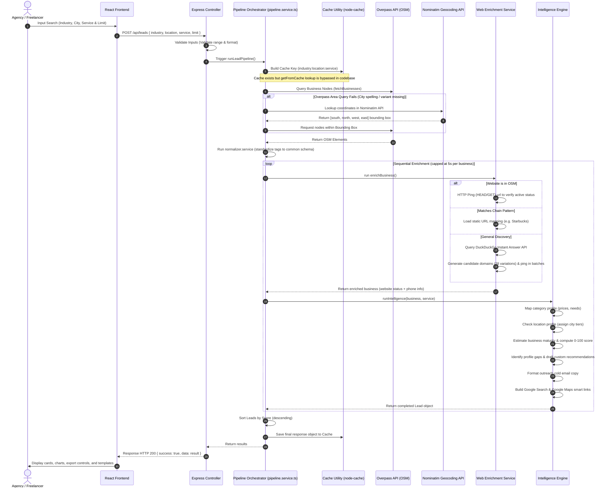

# 🚀 AI Lead Intelligence Engine — Comprehensive System Documentation

A sophisticated, full-stack B2B lead generation, enrichment, and cold outreach system designed to locate underserved local businesses, assess their digital maturity, detect critical presence gaps, and formulate customized service pitches—all with zero API data costs.

---

## 🎯 1. Objectives & Project Goals

Typical lead databases (e.g., Apollo, ZoomInfo) are expensive, charge per-lead fees, and focus heavily on white-collar corporate profiles. The **AI Lead Intelligence Engine** targets local brick-and-mortar businesses using crowdsourced geospatial data.

*   **Zero-Cost Lead Harvesting**: Bypasses costly database fees by extracting physical business coordinates and metadata directly from OpenStreetMap (OSM) via the Overpass API.
*   **Opportunity-Centric Scoring (Inverse Maturity)**: Unlike traditional sales tools that prioritize high-performing companies, this engine operates on an inverse principle: **missing information = higher lead value**. Businesses lacking websites, phone numbers, or active profiles are scored highest, representing high-probability clients for agencies.
*   **Underserved Market Discovery**: Utilizes city tiering logic (Tier 1 vs. Tier 2 vs. Tier 3) to discover businesses in remote or growing regions where digital demand is high but local technical competition is low.
*   **Automated Personalization**: Automatically translates raw business data into targeted action recommendations, contract estimations, and cold emails tailored to the specific industry and digital gap.

---

## 📁 2. Workspace File & Folder Structure

The repository is structured as a monorepo containing a TypeScript backend and a React + Vite frontend:

```text
ai-lead-engine/
├── backend/                             # Express REST API with TypeScript
│   ├── src/
│   │   ├── config/
│   │   │   └── env.ts                   # Type-safe configuration loader (process.env)
│   │   ├── controllers/
│   │   │   └── leads.controller.ts      # Request validation & endpoint handlers
│   │   ├── middleware/
│   │   │   ├── error.middleware.ts      # Global Express error and custom API error boundaries
│   │   │   └── rateLimiter.ts           # DDoS & API abuse protection (express-rate-limit)
│   │   ├── routes/
│   │   │   └── api.routes.ts            # Router declaring '/leads' and '/industries' routes
│   │   ├── services/
│   │   │   ├── intelligence/            # Lead Intelligence and Scoring modular engine
│   │   │   │   ├── category.intel.ts    # Standard contract pricing and industry templates
│   │   │   │   ├── gaps.ts              # Identifies missing business profile fields
│   │   │   │   ├── index.ts             # Orchestrates and runs all intelligence processes
│   │   │   │   ├── location.intel.ts    # Computes city tiers and assigns location weights
│   │   │   │   ├── maturity.intel.ts    # Rates business maturity from listing data
│   │   │   │   ├── outreach.ts          # Templates custom B2B cold emails
│   │   │   │   ├── recommendations.ts   # Formulates custom agency pitch copy
│   │   │   │   ├── scorer.ts            # Aggregates variables into 0-100 score & priorities
│   │   │   │   └── smartlinks.ts        # Generates pre-filled Google Maps/Search links
│   │   │   ├── normalizer.service.ts    # Maps loose OSM tags into structured business models
│   │   │   ├── overpass.service.ts      # Connects to redundant Overpass APIs with bbox fallback
│   │   │   ├── pipeline.service.ts      # Coordinates search, enrichment, scoring, and caching
│   │   │   └── webEnrichment.service.ts # DDG search, chain checks, and domain pinger
│   │   ├── types/
│   │   │   └── index.ts                 # Shared TypeScript models and interfaces
│   │   ├── utils/
│   │   │   ├── cache.ts                 # TTL cache helper using node-cache
│   │   │   └── logger.ts                # Structured, level-based console logging using Winston
│   │   └── server.ts                    # Express app initialization, Helmet, and CORS setups
│   ├── tsconfig.json                    # Backend TypeScript compiler settings
│   ├── .env.example                     # Environment setup template
│   └── package.json                     # Backend node dependencies and scripts
│
├── frontend/                            # React Client Dashboard with Vite
│   ├── src/
│   │   ├── assets/                      # Application image assets and SVGs
│   │   ├── components/
│   │   │   ├── dashboard/
│   │   │   │   ├── InputPanel.tsx       # Search filter form (industry, location, service, limits)
│   │   │   │   └── InsightsSummary.tsx  # KPI metrics (average score, gaps found, priority count)
│   │   │   ├── leads/
│   │   │   │   ├── LeadCard.tsx         # Renders lead details, gaps, recommendations, and email draft
│   │   │   │   ├── LeadGrid.tsx         # Formats lead cards in responsive grids
│   │   │   │   └── ScoreRing.tsx        # Circular SVG metric visualizer for lead score
│   │   │   └── shared/
│   │   │       ├── ErrorBoundary.tsx    # Catch-all component failure wrapper
│   │   │       ├── ProtectedRoute.tsx   # Frontline router guard protecting private pages
│   │   │       └── Sidebar.tsx          # Navigation panel (Dashboard, Saved, Analytics, Settings)
│   │   ├── hooks/
│   │   │   └── useLeads.ts              # Handles fetch state, filtering, exports, and LocalStorage bookmarks
│   │   ├── pages/
│   │   │   ├── AnalyticsPage.tsx        # Interactive charts (Recharts) mapping scores, gaps, and tiers
│   │   │   ├── DashboardPage.tsx        # Lead discovery panel and active leads explorer
│   │   │   ├── LoginPage.tsx            # Styled authentication portal
│   │   │   ├── SavedLeadsPage.tsx       # Renders client-side bookmarked leads list
│   │   │   ├── SettingsPage.tsx         # Profiles, agency configuration, and UI adjustments
│   │   │   └── SignupPage.tsx           # Registration screen
│   │   ├── services/
│   │   │   └── api.service.ts           # Axios client instances mapping to backend endpoints
│   │   ├── store/
│   │   │   └── AuthContext.tsx          # Global context storing current user and mock session
│   │   ├── types/
│   │   │   └── index.ts                 # Frontend data model specifications
│   │   ├── App.css                      # Global styled themes and transitions
│   │   ├── index.css                    # Tailwind-equivalent CSS variables, dark mode styles, and layouts
│   │   ├── main.tsx                     # React application startup file
│   │   └── App.tsx                      # Component routing tree configuration
│   ├── index.html                       # Base template mounting App
│   ├── vite.config.ts                   # Vite bundler configurations
│   ├── tsconfig.json                    # Client TypeScript configurations
│   └── package.json                     # Frontend node dependencies and scripts
```

---

## 🛠️ 3. Technology Stack

### Backend Technologies
*   **Node.js & Express**: Asynchronous server runtime and routing framework.
*   **TypeScript (`ts-node` / `tsc`)**: Server-side typing, compilation, and linting.
*   **Axios**: Outbound HTTP caller interacting with geospatial sources and live pages.
*   **Node-Cache**: High-speed, TTL-driven in-memory cache system.
*   **Helmet**: Sets HTTP response security headers.
*   **Express-Rate-Limit**: Guards endpoints against abuse and DDoS threats.
*   **Winston**: Transmits level-based (info, warn, error) structured logging.

### Frontend Technologies
*   **React 19**: Component lifecycle, rendering engine, and hooks.
*   **Vite**: Frontend compiler supplying rapid hot module reloads (HMR) and bundles.
*   **Material UI (MUI)**: Baseline styling assets, grids, modals, and design inputs.
*   **Recharts**: SVG charting engine plotting lead statistics and analytical graphs.
*   **React Router DOM (v7)**: Navigation engine routing users between app views.
*   **Axios**: Communication layer exchanging payloads with the Express server.
*   **LocalStorage**: Stores user bookmarks (Saved Leads) and mock session authentication context.
*   **Custom CSS Variables**: High-fidelity dark mode palette, custom scrollbars, and animations.

---

## ⚙️ 4. How the Lead Pipeline Works



---

## 🔒 5. API Endpoints

### 1. Generate Leads
*   **URL**: `/api/leads`
*   **Method**: `POST`
*   **Headers**: `Content-Type: application/json`
*   **Request Body**:
    ```json
    {
      "industry": "restaurant",
      "location": "Bengaluru",
      "service": "SEO Optimization",
      "limit": 10
    }
    ```
*   **Response Payload (200 OK)**:
    ```json
    {
      "success": true,
      "meta": {
        "total": 10,
        "highPriority": 3,
        "mediumPriority": 5,
        "lowPriority": 2,
        "gapsDetected": 14,
        "averageScore": 68,
        "location": "Bengaluru",
        "industry": "restaurant",
        "service": "SEO Optimization",
        "generatedAt": "2026-06-21T10:54:32Z",
        "cached": false,
        "source": "overpass"
      },
      "data": [
        {
          "id": "node/12345678",
          "name": "Local Spice Diner",
          "category": "restaurant",
          "address": "45 MG Road, Bengaluru",
          "location": {
            "lat": 12.9716,
            "lon": 77.5946,
            "city": "Bengaluru",
            "country": "India",
            "tier": "Tier 1"
          },
          "contact": {
            "website": null,
            "phone": "+91 98765 43210",
            "email": null,
            "smartLinks": {
              "googleSearch": "https://www.google.com/search?q=Local+Spice+Diner+Bengaluru",
              "googleMaps": "https://www.google.com/maps/search/?api=1&query=12.9716,77.5946"
            }
          },
          "maturity": "low",
          "score": {
            "value": 75,
            "priority": "HIGH",
            "breakdown": {
              "base": 10,
              "websiteGap": 40,
              "emailGap": 10,
              "phoneGap": 0,
              "profileCompleteness": 10,
              "maturityBonus": 15,
              "locationBonus": 10
            }
          },
          "gaps": ["missing_website", "missing_email"],
          "recommendation": {
            "title": "Local SEO & Map Pack Optimization",
            "description": "Establish a Google Business Profile, fix missing tags, and claim spatial coordinates.",
            "estimatedValue": 1500
          },
          "outreachMessage": "Subject: Growth inquiry for Local Spice Diner...\n\nHello Team...",
          "enrichedAt": "2026-06-21T10:54:32Z"
        }
      ]
    }
    ```

### 2. Get Supported Industries
*   **URL**: `/api/industries`
*   **Method**: `GET`
*   **Response Payload (200 OK)**:
    ```json
    {
      "success": true,
      "data": [
        "restaurant", "dental", "gym", "salon", "clinic", "hotel", "cafe",
        "pharmacy", "school", "real estate", "lawyer", "accountant", "plumber",
        "electrician", "mechanic", "bakery", "spa", "yoga", "photography", "hospital"
      ]
    }
    ```

---

## ⚡ 6. Reality Check: Concurrency, Load Limits & Performance Analysis

Many technical writeups present simulated metrics. Here is an honest, source-code-backed analysis of how the system performs under concurrent stress based on its current implementation:

### 🚨 Crucial Architectural Bottlenecks

#### 1. The Sequential Loop Bottleneck (O(N) Blocking Latency)
In [pipeline.service.ts](file:///d:/PROJECTS/ai-lead-engine/backend/src/services/pipeline.service.ts#L26-L55), the business enrichment step uses a blocking synchronous loop over array items:
```typescript
for (const business of businesses) {
  const enrichmentPromise = enrichBusiness(business);
  const timeoutPromise = new Promise<null>((resolve) => setTimeout(() => resolve(null), 5000));
  const enrichment = await Promise.race([enrichmentPromise, timeoutPromise]);
  ...
}
```
*   **Implication**: Every business discovered is enriched *one after another*, rather than in parallel.
*   **Maximum Delay**: The timeout race is set to **5 seconds** per business.
*   **Worst-Case Latency**: If you request a limit of `50` leads (`limit=50`), and all of them fail to resolve websites quickly (resulting in DuckDuckGo fallbacks and candidate pings that hit timeout limits), the server will block processing for up to **250 seconds (4.1 minutes)** for a single request!

#### 2. OpenStreetMap / Overpass API Rate Limits
*   The system uses four public, crowdsourced Overpass interpretation endpoints.
*   The official usage policy for `overpass-api.de` strictly enforces a maximum of **2 concurrent connections per IP address**.
*   **Implication**: If 3 users trigger a search simultaneously, the third connection is queued or rejected with an HTTP `429 Too Many Requests` or `504 Gateway Timeout` error, failing the search pipeline immediately.

#### 3. Nominatim Geocoding API Terms of Service (ToS)
*   The fallback geocoder in [overpass.service.ts](file:///d:/PROJECTS/ai-lead-engine/backend/src/services/overpass.service.ts#L144-L203) queries OpenStreetMap's Nominatim instance.
*   Nominatim's public policy states: **"Maximum 1 request per second. Multiple threads or concurrent queries from a single source are blocked."**
*   **Implication**: Parallel searches triggering Nominatim lookups will violate this policy, leading to the application's server IP being permanently blacklisted.

#### 4. DNS Resolution & Thread Pool Depletion (libuv)
*   For each business without an OSM website, [webEnrichment.service.ts](file:///d:/PROJECTS/ai-lead-engine/backend/src/services/webEnrichment.service.ts#L131-L176) generates up to **28 candidate domains** (e.g., `https://www.name.com`, `https://name.in`) and pings them in parallel batches of 3.
*   Pinging non-existent domains forces Node to perform external DNS resolutions.
*   In Node.js, DNS lookups (`dns.lookup`) use synchronous system calls executed inside the thread pool managed by `libuv`. The default size of this thread pool is **4 threads** (`UV_THREADPOOL_SIZE = 4`).
*   **Implication**: Running even 2 concurrent searches will launch dozens of parallel DNS lookups, saturating the `libuv` thread pool. This stalls all other standard asynchronous I/O operations (such as incoming Express requests, file operations, and logging) and causes severe event loop lag.

#### 5. Broken Caching System (100% Cache Bypass)
*   Although [pipeline.service.ts](file:///d:/PROJECTS/ai-lead-engine/backend/src/services/pipeline.service.ts#L62) calls `setInCache(cacheKey, response)` to cache results in-memory, the orchestrator **never calls `getFromCache`** before launching searches.
*   **Implication**: Caching is bypassed entirely. Every request results in a Cache MISS, making full queries to Overpass, Nominatim, DuckDuckGo, and candidate domains on every search, regardless of whether that search was performed seconds ago.

---

### 📊 Real Capacity Estimates

| Category | Supported Limit | Operational Outcome & Impact |
| :--- | :--- | :--- |
| **Max Active Lead Generations** | **1 to 2 concurrent users** | Beyond 2 parallel queries, the Overpass API returns `429`, Nominatim blocks the server IP, and the thread pool stalls. |
| **Active Dashboard Viewers** | **5,000+ concurrent users** | Pages, saved lists, and UI analytics are handled in browser `localStorage`. Static files can be served via CDN. |
| **Average Response Time** | **5s – 25s** (limit = 10)<br>**30s – 120s** (limit = 50) | Driven by sequential website validation pings and Overpass endpoint query responses. |
| **Throughput (Lead Queries/Sec)**| **~0.05 to 0.1 RPS** | Limited by long request response times and connection caps on free external engines. |

---

## 🛠️ 7. Recommendations for Scalability & Production Use

To scale the project to support hundreds of concurrent lead generation requests, apply the following optimizations:

1.  **Repair Cache Checks**: Implement the cache check at the beginning of the pipeline:
    ```typescript
    const cachedResponse = getFromCache<ApiResponse<Lead[]>>(cacheKey);
    if (cachedResponse) {
      logger.info('Cache HIT - returning leads', { cacheKey });
      return cachedResponse;
    }
    ```
2.  **Parallelize Enrichment**: Replace the sequential loop in `pipeline.service.ts` with a parallel processing model using `Promise.all` or a concurrency-limited pool (such as `p-limit` set to a limit of 5-10 parallel tasks):
    ```typescript
    // Example using p-limit for controlled concurrency
    const limitConcurrency = pLimit(10);
    const leadPromises = businesses.map(business => 
      limitConcurrency(async () => {
        // Run enrichment and intelligence...
      })
    );
    const leads = await Promise.all(leadPromises);
    ```
3.  **Dedicated Geocoding & Mapping Services**: Replace free public OpenStreetMap endpoints with commercial services (like Mapbox, Google Maps API, or a self-hosted Overpass/Nominatim instance using Docker).
4.  **Asynchronous Message Queue**: Transition the `/api/leads` route into a background job system (using Redis and BullMQ). Instead of keeping HTTP connections open for minutes, return a `202 Accepted` status with a job ID, perform enrichment in background worker threads, and push updates to the client via WebSockets or SSE.
5.  **Adjust Threadpool Size**: Increase the libuv threadpool size in the backend start script to avoid DNS-related execution stalls:
    ```bash
    # Windows PowerShell
    $env:UV_THREADPOOL_SIZE=64; npm run dev
    ```

---

## ⚙️ 8. How to Set Up and Run the Project

### 1. Environment Configurations

#### Backend Environment Settings (`backend/.env`)
Create a `.env` file inside the `backend` folder:
```env
PORT=5000
NODE_ENV=development
ALLOWED_ORIGINS=http://localhost:5173
RATE_LIMIT_WINDOW_MS=900000
RATE_LIMIT_MAX_REQUESTS=100
CACHE_TTL_SECONDS=300
OVERPASS_TIMEOUT_MS=25000
```

#### Frontend Environment Settings (`frontend/.env`)
Create a `.env` file inside the `frontend` folder:
```env
VITE_API_BASE_URL=http://localhost:5000
```

### 2. Booting Up the Services

#### Backend Setup
1.  Navigate into the backend folder:
    ```bash
    cd backend
    ```
2.  Install dependencies:
    ```bash
    npm install
    ```
3.  Launch the development server:
    ```bash
    npm run dev
    ```
    The server will start listening at `http://localhost:5000`.

#### Frontend Setup
1.  Navigate into the frontend folder:
    ```bash
    cd ../frontend
    ```
2.  Install dependencies:
    ```bash
    npm install
    ```
3.  Launch the Vite developer client:
    ```bash
    npm run dev
    ```
    Open your browser and navigate to `http://localhost:5173`. Use any mock credential set to log into the dashboard (sessions are stored in your browser's local state).
